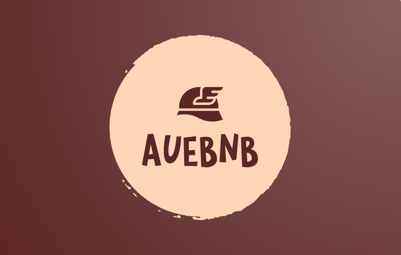

# AueBNB

Welcome to the AueBNB project! AueBNB is a mobile application aimed at providing a convenient platform for finding and booking accommodations.  
The original repository in gitlab can be found [here](https://gitlab.com/distributedsystems7794216/auebnb).

## Info

This project is developed as part of the subject "Distributed Systems" in the Athens University of Economics and Business (AUEB). The project is organized in two parts. The backend part contains the basic implementation of the app(Master,Worker,Reducer) and two dummy consoles for both the manager and the user. The frontend part contains an Android application that allows the customer to search for suitable accommodations based on their preferences and book their desired option. The app provides a user-friendly interface to interact with the backend system, ensuring a seamless experience in finding and reserving accommodations.

## Full Description

In recent years there has been a great increase in room rental applications. These systems usually consist of a mobile frontend application for the management of the accommodation by users (viewing, renting and adding accommodation) and a backend system which takes care of the analysis, processing and storage of data. Known services available online are e. g. Airbnb and Booking. In the context of the project you have to create a simple accommodation management system in which users will be able to perform manager and tenant functions.

In manager mode you should be able to:
- Add accommodation
- Add the available dates for rent for these accommodations
- Display reservations for the accommodation they own.
- Management can be done via console application

In tenant mode they should be able to:
- Filter the accommodations
    1. with the area they are interested in
    2. the date they want
    3. number of persons
    4. price
    5. stars
- Make a reservation for the accommodation they are interested in
- Rate the room with stars (1-5)
- Through a UI on Android to be able to perform the above actions:
    1. A search() function will send the filter to the Master asynchronously and will displays the search results on the application screen.
    2. Through a book() function the user will be able to reserve a property from the properties returned by search()


In order for the system to be able to manage the large amount of data it must run distributed over a set of machines. The MapReduce framework is a programming model that allows the parallel processing of large volumes of data. 
MapReduce relies on the use of two functions:

- map(key,value) -> [(key2, value2)]

"Map" function: processes a key/value pair and produces an intermediate key/value pair. The input to the map function can be lines of a file, etc., and have the format (key, value). The map function converts every such pair in another pair (key2, value2). The map function can be runs in parallel, on different inputs and on different Nodes. The degree of parallelism depends on the application and can set by the user.

- reduce(key2,[value2]) -> [final_value]

"Reduce" function: merges all intermediate values related to the same key and produces the final results. For each separate key is created A list of the values that correspond to this key. This function Calculates a final value for the key by processing the list of values that correspond to this key. The reduce function is processed after All map functions have finished processing.

Initially when a user wishes to add a room to the platform, they must give the room description in a json file, as well as a photo. You can have a folder containing the json and the photograph. The path of the photo contained within the json. The json must also contain a review counter and the property's rating (1-5). Also it must provide a way so available dates can be declared.

The initial communication of the manager's console app should be with the Master where all the details of the accommodation will be sent. The Master, after receiving the elements shoud select, through a hash function H(roomName),the worker node on which the accommodation will be stored. E.g. NodeId = H(roomName) mod NumberOfNodes. After selecting the node it sends the information to it. For contexts of the work the Worker will store the information in the appropriate data structures in its memory. Saving to disk is not allowed.

When a user wishes to rent an accommodation initially through the application they must select the appropriate filters for the accommodation. Then a request is sent to the Master containing the filters. The Master should return to the user the accommodations that meet the criteria by the process of MapReduce.

After they are shown to the user, he will be able to see the details and the photo of the room and make a reservation if desired. When the user makes a reservation, it sends a reservation request to the Master for the specific accommodation and the Master in turn must inform accordingly the Worker who manages the accommodation for the reservation. Measures should be taken so that no simultaneous reservatopm of the same accommodation can occur for the same dates.

Finally the manager mode must be able to display the total reservations of each area for a specific period of time that will be given by user.

## Interact with our app

### Phase 1 - Download
1. Clone our repository in your directory

### Phase 2 - Compile
1. Locate the backend folder and open the cmd in that folder
2. Compile the java files using:  

    ```sh
    javac app/src/*.java
    ```
### Phase 3 - Configuration
1. Locate the folder backend/data
2. Find and open the following files:  

    - masterCFG.txt
    - reducerCFG.txt
    - workerCFG.txt  
         
    > **Note:** The backend can be run in two modes:
    > - **Single-computer Mode** All modules (Master, Reducer, Worker) run on the same computer. In this you must use `localhost` in each host.
    > - **Distributed Mode:** The application can be run across multiple computers, where each module (Master, Reducer, Worker) runs on a different machine. In this case, you need to configure the IP addresses of each machine in the respective configuration files.

3. **(Single-computer Mode)**: Use localhost as the host in each host field

    **(Distributed Mode)**: Change the host field of each module based on your setup. **Example:** If the Master is hosted on a machine with IP ip1, locate the masterhost in each cfg file and change it to ip1 (if the masterhost field exists in the file). Do the same for Worker1, Worker2, Worker3 and the Reducer  


### Phase 4 - Execution
> **Note:** You can run the user app by using the user console app or by using the phone app. The instructions will include the console app method but it will mentioned as optional if you use the android app

1. Locate backend folder and open 8 command prompts (or 7 if you use the android app)  

     Workers - 3 command prompts, 1 for each WorkerServer  
     Reducer - 1 command prompt for the ReducerServer  
     Master - 1 command prompt for the MasterServer  
     Manager Console - 1 command prompt for the Manager Console  
     Account Server - 1 command prompt for the Account Server  
     User Console - 1 command prompt for the User Console (Optional if you use the android app)  


2. Run each module on the corresponding command prompt using the following commands:  

    Worker1 - ```java app/src/ServerWorker 5010```  
    Worker2 - ```java app/src/ServerWorker 5011```  
    Worker3 - ```java app/src/ServerWorker 5012```  
    Reducer - ```java app/src/ReducerServer```  
    Master - ```java app/src/MasterServer```  
    Account Server - ```java app/src/AccountServer```  
    Manager Console - ```java app/src/ManagerConsoleApp```  
    User Console - ```java app/src/UserConsoleApp```  (Optional if you use the android app) 


3. Initialize the Workers data from the ManagerConsoleApp command prompt (Select 1 and press enter)

4. Interact with the app as a Manager: 
     Use the command prompt of the ManagerConsoleApp to interact with the app as the manager.   

    Select the desired option using the corresponding number: 

        1. Initiallize workers data (Only use it at the start of the app)
        2. Show your accommodation bookings  
        3. Show reservations for a specific period of time  
        4. Exit

5. Interact with the app as a User: 
      **Using the UserConsoleApp:** Use the command prompt of the UserConsoleApp to interact with the app.  
    Select the desired option using the corresponding number: 
       
        1. Initiallize workers data   
        2. Show your accommodation bookings  
        3. Show reservations for a specific period of time  
        4. Exit  
    
      **Using the Android App:** Open the project in the Android Studio. Locate the frontend folder and access the java files inside app/src/main/java/com/example/auebnb. Locate the following java files:  

       1. BookThread.java  
       2. RatingThread.java  
       3. RoomDisplayThread.java  
       4. SearchThread.java  
       5. LoginThread.java  
       6. RegisterThread.java    
    
    For files 1-4 locate the following command and change the ip to the ip of the machine that hosts the MasterServer:
      ```
      requestSocket = new Socket("192.168.1.6", 5000);
      ```
     For files 5 and 6 locate the following command and change the ip to the ip of the machine that hosts the AccountServer:
      ```
      requestSocket = new Socket("192.168.1.6", 5003);
      ```
    
     Finally connect your phone to your computer and install the app through the Android Studio. Your phone is needed because the Android Emulator can't connect to the wifi. In order to connect your phone to the Android Studio you need to enable the debugging mode through the developer options.

> **Note:** You might need to disable your firewall in order to run the app.


